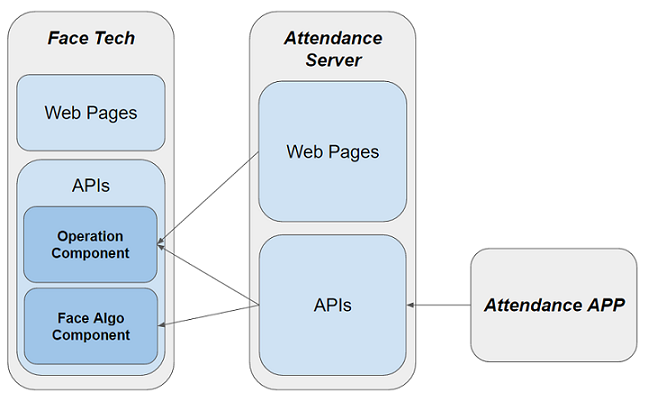

# Face_Web
   Face algorithm API, provide face recognition, enrollment, verification function, and profile management. Attendance below is one application based on this.  
   [More Details](face_web/README.md)  
   [How to use Face API?](face_web/face_tech/templates/mkdocs/docs/getstart.md)
    
   
   
# Attendance  
## Attendance Website
   A website designed for Attendance APP. Here you can create modules, students, and check real time statistic reports of your class attendance.  
   [More Details](https://github.com/fcharmy/face/blob/master/attendence/README.md)
  
## Attendance APP
   Login with your regular account or NUS account, which automatically update module info, you may enroll/take attendance of your students during lecture or tutorials, check history records anytime.  
   [More Details](https://github.com/fcharmy/face/blob/master/app_attendance/README.md)
